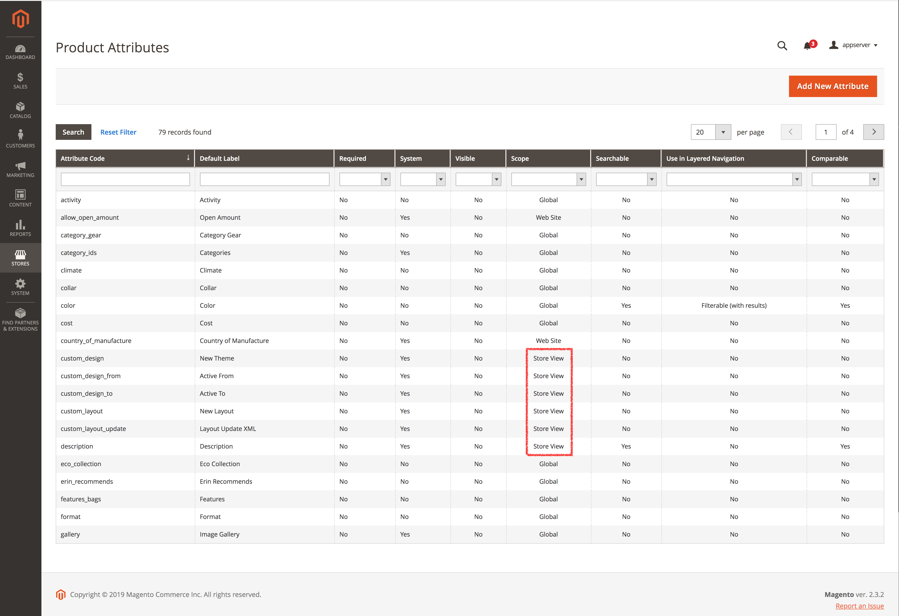

The import functionality provides a possiblity to import values on different scopes. Therefore, all scope specific values has to be added on a separate row for each scope, which represents a store view, like

| sku     | store_view_code | attribute_set_code | product_type | name          | description                          | url_key       | ...     |
|:--------|:----------------|:-------------------|:-------------|:--------------|:-------------------------------------|:--------------|:--------|
| MB-2401 |                 | Default            | simple       | Duffle Bag    | This the default description.        | duffle-bag    |         |
| MB-2401 | de_DE           |                    |              | Reisetasche   | Das ist die deutsche Beschreibung.   | reisetasche   |         |
| MB-2401 | fr_FR           |                    |              | Sac Marin     | C'est la description par défaut.     | sac-marin     |         |
| MB-2401 | es_ES           |                    |              | Bolsa de Lona | Esta es la descripción por defecto.  | bolsa-de-lona |         |

The column `store_view_code` **MUST** contain the appropriate Magento store view code.

### Which Attributes that can be Translated

For sure, not all attributes can have different values per scope. In general all product attributes that has been created with scope *Store View* can be translated. To find out which attributes have the scope *Store View* open the Backend and go to the overview with the product attributes by clicking on the navigation path *Stores > Attributes > Products*. Select the filter *Store View* and press enter, the result should look like

